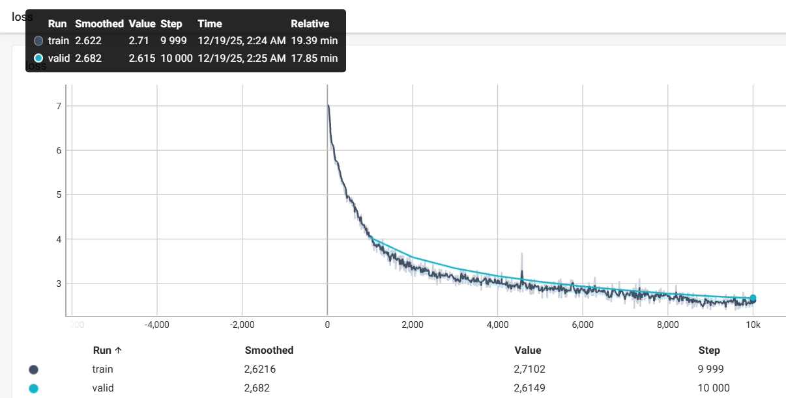
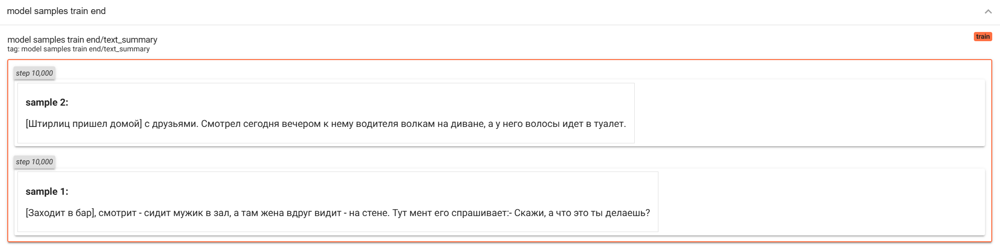

# info

**run command**

```bash
python -m main
```

# results

## result for 10k train steps:

**loss:**



**samples:**



**medium pretrain speed:**

torch profiler and memory snapshot is enabled (takes less than 1 second)

- 100/100 [00:42<00:00,  2.35it/s] - Windows, no optimizations